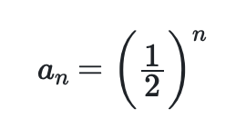

# Plotting series data

Lets now plot the geometric sequence: 



The first few terms in this series are:


I want you to proceed in a similar way to the previous exercise.  In other words, I want you to create an array.  This time your array should have only 20 elements and you should use a for loop to the elements of this array to the first 20 terms in this sequence.  
The first element of the array will thus be 0, the second will be 1/2, the third 1/4 and so on. 

In addition, to this array I also want you to create a 20-element array that holds the integers from 0 up to 19.  The first element in this array should be 0 the second element should be 1 and so on. 

To complete this exercise I want you to use python to draw a graph in which the first 20 integers are on the x-axis and the terms in the geometric sequence are on the right.  

Remember the python commands you  use to draw a graph in which the x-coordinates of the points are in an array called `indices` and the y-coordinates are in an array called `geometric`  are:

```python
plt.plot( indices, geometric, 'ko' )
plt.savefig( "geometric.png" )
```
***
These commands are making use of functionality from a Python library called matplotilb.  To use these commands you thus need to include:

```python
import matplotlib.pyplot as plt
```

at the top of your python script.

The x-axis should be labelled __Index__ and the y-axis label should be labelled __Geometric series__
